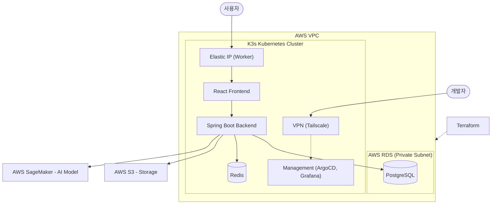

# Gloc-key

**Gloc-key는 AI 기반 교육자료 생성 및 편집 서비스입니다.**

AWS SageMaker를 활용한 맞춤형 AI 이미지 생성부터, 브라우저 기반 에디터(React-Konva)를 통한 실시간 편집 및 히스토리 관리까지 하나의 워크플로우로 제공합니다.

---

## ✨ 주요 기능
- **AI 교육자료 생성**: SageMaker를 연동한 교육용 이미지 생성
- **콘텐츠 히스토리 관리**: 생성된 교육자료 기록 저장 및 조회
- **교육자료 에디터**: 브라우저 기반의 이미지 편집 도구 (React-Konva 기반)
- **인프라 자동화**: Terraform 및 K3s를 이용한 안정적인 서비스 배포
- **실시간 모니터링 및 알림**: 
  - **Alertmanager**: 시스템 성능 저하 및 에러 발생 시 Slack 실시간 알림
  - **AWS NTH**: Spot 인스턴스 중단 및 교체 이벤트 감지 시 Slack 알림

---
### 💻 Development Stack
| 분류 | 기술 스택 |
| :--- | :--- |
| **Frontend** |     |
| **Backend** |     |
| **Database** |   |
| **AI** |  |

### ☁️ Infrastructure & DevOps Stack
| 분류 | 기술 스택 |
| :--- | :--- |
| **Public Cloud** |  |
| **IaC** |  |
| **Orchestration**|   |
| **Monitoring** |      |
| **Logging & Tracing**|   |
| **Networking** |   |
| **Security** |   |
| **Automation** |    |

---
## ☁️ Infrastructure Architecture


## System Workflow



## 📂 디렉토리 구조

```text
.
├── frontend/           # React 기반 프론트엔드 (Vite)
├── gloc-key/           # Spring Boot 기반 백엔드 API 서버
├── k3s/                # Kubernetes (K3s) 매니페스트 및 자동화 설정
│   ├── Application/    # 애플리케이션 서비스 설정
│   ├── base/           # 공통 베이스 설정
│   ├── bootstrap/      # 클러스터 초기 구성
│   ├── infra/          # 인프라 관련 서비스 (Redis, DB 등)
│   └── setup/          # 모니터링, 메시징, 보안 도구 (ArgoCD, Prometheus 등)
└── terraform/          # AWS 리소스 관리를 위한 IaC 코드
```

---
## 💰 Infrastructure Cost Analysis
**Infracost**를 활용하여 인프라의 월간 예상 비용을 모니터링하고 있습니다. 특히 워커 노드에 **Auto Scaling Group(ASG)** 과 **Spot Instance**를 도입하여, 온디맨드 대비 약 **51%** 의 비용 절감과 함께 인스턴스 중단 시의 자동 복구 구조를 운영 중입니다.

| 리소스 구분 | 세부 항목 | 사양 | 월간 비용 |
| :--- | :--- | :--- | :--- |
| **데이터베이스 (RDS)** | PostgreSQL Instance | db.t3.micro (Single-AZ) | $20.44 |
| | RDS Storage (SSD) | 20GB (gp2) | $2.62 |
| **마스터 노드 (K3s)** | EC2 Instance | t3a.small (On-demand) | $17.08 |
| | EBS Storage | 30GB (gp3) | $2.74 |
| **워커 노드 (K3s)** | Auto Scaling Group (Spot) | t3a.medium (Spot) | $16.64 (약 51%↓) |
| | EBS Storage | 30GB (gp3) | $2.74 |
| **네트워크** | Elastic IP (EIP) | Unused IP fee | $3.65 |
| **도메인 (DNS)** | Route53 Hosted Zone | glok.store | $0.50 |
| **전체 합계 (Total)** | | | **$66.41** |

